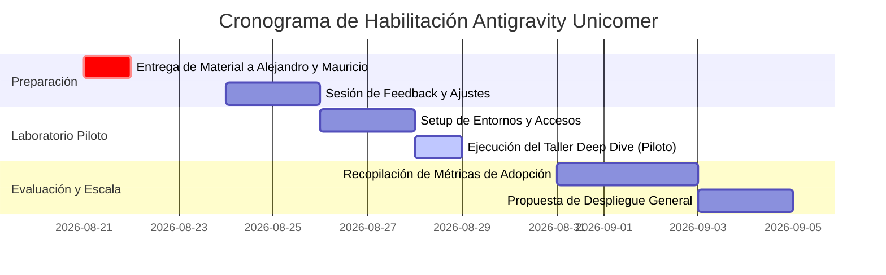

# 📑 Material de Revisión: Taller Deep Dive Antigravity & Gemini Skills
## Documento para Revisión y Alineación con Alejandro y Mauricio

**Fecha de Entrega para Revisión:** Viernes (Semana previa al taller)  
**Facilitador:** Israel Castillo (Google Cloud / Antigravity Lead)  
**Destinatarios:** Alejandro, Mauricio  
**Objetivo de la Reunión:** Revisar la estructura técnica, validar los laboratorios prácticos de Unicomer, confirmar la estrategia de integración con VS Code y afinar detalles antes de la sesión piloto con desarrolladores.

---

## 🎯 1. Resumen Ejecutivo y Propósito

Grupo Unicomer está evaluando la adopción de herramientas de desarrollo asistidas por Inteligencia Artificial para acelerar el ciclo de vida del software (SDLC), modernizar sus aplicaciones de retail/fintech (ej. *La Curacao, Emma, RadioShack, Gollo*) y elevar la productividad de sus equipos de ingeniería.

Este taller técnico está diseñado para demostrar que **Google Antigravity no es solo un copiloto de autocompletado**, sino una **plataforma completa de ingeniería de software agéntica**. 

### 🔑 Mensajes Clave para el Equipo de Desarrollo de Unicomer:
1. **Salto de Productividad de Días/Semanas a Horas:** De la asistencia línea por línea a agentes autónomos que planifican, ejecutan cambios multifile y verifican el código (*Plan → Act → Verify*).
2. **Cero Fricción en el Entorno Actual:** Compatibilidad nativa con VS Code, JetBrains y terminal CLI, permitiendo a los desarrolladores trabajar donde ya son productivos.
3. **Gobierno Corporativo y Seguridad:** Control centralizado de cuotas agrupadas (*Pooled Quotas* de \$10/\$15 USD por desarrollador/mes en Gemini Enterprise), auditoría de prompts, sandboxing y políticas de ejecución.
4. **Habilidades Personalizadas (*Gemini Skills*):** Capacidad de empaquetar reglas de negocio, estándares de arquitectura y políticas de crédito de Unicomer directamente en el agente.

---

## 📅 2. Plan de Trabajo y Cronograma de Hitos

---

## 📊 3. Desglose del Contenido del Taller (Agenda Técnica)

| Bloque | Duración | Tema Principal | Enfoque Práctico / Demo |
| :--- | :--- | :--- | :--- |
| **Bloque 1** | 30 min | **Visión y Arquitectura Agéntica** | Presentación ejecutiva + benchmarks Gemini 3.7 Flash vs Sonnet / GPT |
| **Bloque 2** | 20 min | **Superficies de Antigravity** | Antigravity 2.0 (GUI), Antigravity CLI y Extensión VS Code (Roadmap GA) |
| **Bloque 3** | 40 min | **Laboratorio 1 & 2: Flujo Base y Skills** | Refactorización de API Unicomer + Creación de `SKILL.md` corporativo |
| **Bloque 4** | 40 min | **Laboratorio 3: Subagentes y Testing** | Despliegue de subagentes en paralelo (Refactor, Security Audit, Unit Tests) |
| **Bloque 5** | 20 min | **Gobierno, Cuotas y Q&A** | Quotas (\$10/\$15), Spend Caps, Sandbox, Políticas de Terminal y Cierre |

---

## 🛠️ 4. Laboratorio Práctico Propuesto (Caso de Uso Unicomer)

Para garantizar la relevancia inmediata, el laboratorio utiliza un caso de uso adaptado a Unicomer: **`unicomer-credit-eligibility-api`** (un microservicio FastAPI de evaluación de crédito y cálculo de lealtad).

### Dinámica del Laboratorio:
1. **Problema Inicial:** La API tiene un endpoint con un fallo en la fórmula de ratio de endeudamiento (*Debt-to-Income DTI*), carece de validación de estándares REST de Unicomer y le faltan pruebas unitarias para clientes VIP.
2. **Paso 1 (Plan):** El desarrollador solicita a Antigravity analizar el repositorio y generar un *Implementation Plan*.
3. **Paso 2 (Act + Skill):** Se aplica el custom skill `unicomer-credit-policy` para corregir la fórmula y estructurar las respuestas según el estándar Unicomer.
4. **Paso 3 (Verify):** Antigravity ejecuta `pytest` dentro del sandbox, detecta edge cases y genera la suite de pruebas automatizada sin salir del flujo.
5. **Paso 4 (Subagentes):** Se lanza un subagente auditor de seguridad para verificar que no haya exposición de datos sensibles (PII/DUI/NIT) en logs.

---

## 🔍 5. Estado de la Integración con Visual Studio Code

Uno de los puntos clave acordados fue clarificar el estado del plugin de VS Code:

- **Estado en Roadmap:** **General Availability (GA) en Agosto**.
- **Mecanismo de Despliegue:** Extensión oficial instalable desde el VS Code Marketplace o empaquetada como archivo `.vsix` corporativo.
- **Autenticación:** Soporte nativo para *Application Default Credentials (ADC)* y *Workload Identity Federation* a través de Gemini Enterprise Agent Platform.
- **Experiencia de Usuario:** Mantiene paridad con la CLI compartiendo los mismos archivos de configuración global (`~/.gemini/settings.json`), skills y reglas de proyecto (`.agents/skills/`).

---

## 📝 6. Rúbrica de Feedback para Alejandro y Mauricio

Por favor revisar los siguientes aspectos y proporcionar retroalimentación:

- [ ] **Alineación de Casos de Uso:** ¿El microservicio de evaluación de crédito y retail refleja adecuadamente las prioridades de los equipos de desarrollo de Unicomer?
- [ ] **Profundidad Técnica:** ¿El balance entre la presentación conceptual (30%) y el laboratorio práctico (70%) es adecuado para el grupo piloto?
- [ ] **Configuración de Entorno:** ¿Los desarrolladores tendrán acceso a terminal con Python 3.10+ y VS Code, o prefieren que facilitemos contenedores pre-configurados?
- [ ] **Métricas de Éxito del Piloto:** ¿Qué KPIs definirán el éxito de la sesión? (Ej. Reducción de tiempo en resolución de bugs, satisfacción del desarrollador > 4.5/5, adopción de custom skills).

---

## 📬 Contacto y Siguientes Pasos
Tras recibir sus comentarios el viernes, aplicaremos los ajustes el lunes y enviaremos la guía de prerrequisitos a los participantes del grupo piloto.
