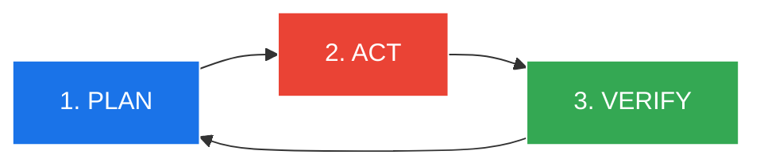
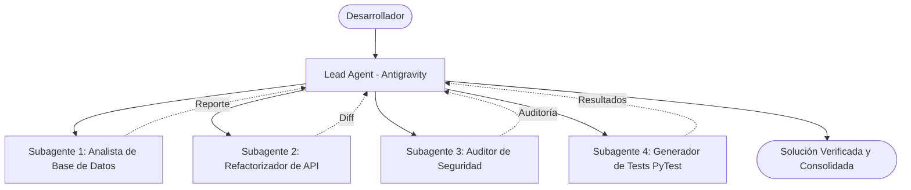

# 🖥️ Contenido de Presentación Técnica: Google Antigravity & Gemini Skills Deep Dive

**Cliente:** Grupo Unicomer (El Salvador)  
**Presentador:** Israel Castillo  
**Duración:** 45 - 60 minutos de exposición + 90 minutos de laboratorio interactivo  

---

## 📑 Índice de Diapositivas

```
MÓDULO 1: La Revolución Agéntica (Slides 1 - 6)
MÓDULO 2: Arquitectura y Modelos: Gemini 3.7 Flash (Slides 7 - 10)
MÓDULO 3: Las Superficies de Antigravity: 2.0, CLI e IDE (Slides 11 - 15)
MÓDULO 4: El Ciclo de Ingeniería: Plan → Act → Verify (Slides 16 - 19)
MÓDULO 5: Subagentes, Sidecars y Habilidades (Skills) (Slides 20 - 24)
MÓDULO 6: Gobierno Empresarial, Seguridad y Cuotas Agrupadas (Slides 25 - 29)
MÓDULO 7: Roadmap y Caso de Uso Práctico Unicomer (Slides 30 - 33)
```

---

## 📽️ Módulo 1: La Revolución Agéntica

### Diapositiva 1: Portada
- **Título:** Google Antigravity: La Suite de Herramientas para Desarrolladores Agénticos
- **Subtítulo:** Acelerando el SDLC en Grupo Unicomer con Gemini Enterprise
- **Notas del Orador:** 
  > *"Bienvenidos al Deep Dive técnico de Google Antigravity. Hoy veremos cómo evolucionar de simples autocompletados de código a sistemas autónomos que resuelven requerimientos completos, ejecutan pruebas y garantizan los estándares de arquitectura de Unicomer."*

---

### Diapositiva 2: Evolución de las Herramientas de IA para Desarrolladores
- **Gráfico Comparativo:**
  - **Fase 1: AI-Assisted Coding (Copilots):** Autocompletado de líneas. Ayuda puntual, pero guiada 100% por humanos de forma incremental. Escala de tiempo: *Semanas*.
  - **Fase 2: Interactive Agents:** La IA actúa como intermediaria. Descompone la intención en listas de tareas y ejecuta acciones semiautónomas. Escala de tiempo: *Días*.
  - **Fase 3: Full Agentic Systems (Antigravity):** Le das al agente una meta de negocio/técnica. Él planifica, escribe código multifile, corre pruebas, diagnostica errores y documenta, trabajando en paralelo en segundo plano. Escala de tiempo: *Horas*.
- **Notas del Orador:**
  > *"El problema de los copilotos tradicionales es que el desarrollador sigue siendo el cuello de botella para escribir cada prueba y revisar cada archivo. Antigravity introduce delegación real."*

---

### Diapositiva 3: El Desarrollo Agéntico Empresarial Requiere Nuevas Bases
- **Pilares Fundamentales:**
  1. 🛡️ **Seguridad Empresarial por Defecto:** Sandboxing, sin fuga de código a entrenamiento público, ejecución segura de comandos.
  2. 💰 **Control de Costos Predecible:** Cuotas agrupadas por proyecto y límites de gasto configurables (*Spend Caps*).
  3. ⚙️ **Auditoría y Observabilidad Total:** Trazabilidad de cada decisión del agente, logging de prompts/respuestas y telemetría.
  4. 🔌 **Flexibilidad y Elección:** Libertad de interfaz (CLI, IDE VS Code/JetBrains, GUI 2.0) y protocolos abiertos (Model Context Protocol - MCP).
  5. ✨ **Co-optimizado con Gemini:** Modelos de razonamiento profundo ajustados específicamente para flujos de codificación agénticos.

---

### Diapositiva 4: "Los Pilotos son Fáciles. Escalar en la Empresa es el Reto."
- **Ejes de Antigravity en Gemini Enterprise:**
  - **Build (Construir):** Acelere el *time-to-production* con flujos agénticos paralelos.
  - **Optimize (Optimizar):** Monitoree consumo, fije topes de presupuesto y aproveche cuotas unificadas para escalar con confianza.
  - **Secure (Asegurar):** Integre privacidad corporativa, cumplimiento normativo y aislamiento estricto en cada fase del desarrollo.

---

## 🧠 Módulo 2: Arquitectura y Modelos: Gemini 3.7 Flash

### Diapositiva 5: Antigravity es la Superficie Pro-Code del Ecosistema Gemini
- **Diagrama de Capas:**
  - **Capa Superior (Apps & Dev Tools):** Antigravity (CLI, IDE, 2.0), Gemini Enterprise App, Apps personalizadas, Gemini Enterprise for CX.
  - **Capa Media (Agent Platform):** Plataforma unificada de agentes (Gobierno, Escalabilidad, Catálogo de Modelos).
  - **Capa de Modelos:** Gemini 3.7 Flash, Gemini 3.5 Flash-Lite, Gemini Pro, Terceros y Open Models.
  - **Infraestructura:** Google AI Hypercomputer (TPUs v5e/v5p optimizadas para baja latencia de inferencia y alto throughput).

---

### Diapositiva 6: Gemini 3.7 Flash: El Modelo Estrella para Ingeniería Agéntica
- **Destacados de Rendimiento:**
  - **Mayor Inteligencia al Mismo Costo:** Salto masivo en densidad de razonamiento y capacidad de ejecución de herramientas (*Tool Calling*).
  - **DeepSWE Benchmark:** **63.7%** de precisión en resolución de problemas complejos de ingeniería de software en primer intento.
  - **FrontierCode 1.1:** **43.6%** en calidad de código para producción (superando a Claude Sonnet 5 con 42.7%).
  - **Code Arena (Web Dev):** **1588 Elo** en generación de UI moderna y lógica frontend.
  - **AutomationBench:** **30.4%** en finalización de flujos de trabajo empresariales reales (vs GPT-5.6 Terra con 23.6%).
  - **Costo por Tarea:** Curva líder de eficiencia económica en tareas de horizonte largo.

---

## 💻 Módulo 3: Las Superficies de Antigravity

### Diapositiva 7: Un Solo Harness Agéntico, Múltiples Superficies
- **Las 4 Expresiones de Antigravity:**
  1. **Antigravity 2.0 (GUI Web/Desktop):** Orquestación visual avanzada, soporte de voz, gestión de tareas en background, tableros Kanban agénticos y visualización de artefactos en tiempo real.
  2. **Antigravity CLI (Terminal):** Experiencia ágil y ultraligera para terminal. Comandos nativos, cero sobrecarga, ideal para desarrolladores backend y DevOps.
  3. **Antigravity IDE Extension (VS Code / JetBrains / Zed):** Trae la potencia del harness agéntico directo a tu editor preferido sin cambiar de contexto.
  4. **Antigravity SDK:** Biblioteca para construir tus propias herramientas y extensiones internas sobre el harness.

---

### Diapositiva 8: Antigravity CLI: Potencia en la Terminal
- **Capacidades:**
  - **Agentic Coding & Editing:** Modificación atómica de código con diffs precisos.
  - **Custom Slash Commands:** Cada *Skill* creada en el repositorio se convierte automáticamente en un comando de barra (ej. `/unicomer-credit-check`, `/api-lint`).
  - **Plataforma Unificada:** Comienza una tarea en CLI y ábrela en Antigravity 2.0 si requieres inspección visual profunda; el contexto viaja contigo.

---

### Diapositiva 9: Antigravity en Visual Studio Code
- **Disponibilidad:** **General Availability (GA)** en roadmap de Agosto.
- **Características:**
  - Integración nativa en el panel lateral y menú contextual.
  - Soporte de autenticación con credenciales corporativas (ADC / SSO).
  - Respeto total a las políticas de seguridad administradas desde la consola de Google Cloud.
  - Carga automática de `AGENTS.md` y `.agents/skills/` del repositorio abierto.

---

## 🔄 Módulo 4: El Ciclo de Ingeniería: Plan → Act → Verify

### Diapositiva 10: El Bucle Agéntico Transparente

- **Fase 1: Plan (Planificación)**
  - El agente lee el repositorio, analiza dependencias, genera un **Implementation Plan** estructurado con riesgos, alcance y pasos secuenciales.
  - El desarrollador revisa y aprueba el plan antes de tocar una sola línea de código.
- **Fase 2: Act (Acción)**
  - Generación de código multifile mediante reemplazos atómicos y diffs limpios.
  - No destruye comentarios ni lógica no relacionada.
- **Fase 3: Verify (Verificación)**
  - Ejecución de pruebas unitarias (`pytest`, `npm test`), linters y compiladores en un sandbox aislado.
  - Auto-corrección inmediata si una prueba falla antes de entregar el resultado al desarrollador.

---

### Diapositiva 11: Artefactos Inspeccionables
- **¿Qué entrega el agente?**
  - 📝 **Planes de Implementación (`implementation_plan.md`):** Hoja de ruta técnica con botón "Proceed".
  - 🔍 **Diffs de Código:** Comparativas visuales de cambios.
  - 🚶 **Change Walkthroughs (`walkthrough.md`):** Explicación detallada de decisiones técnicas y archivos afectados.
  - 📸 **Capturas y Grabaciones del Navegador:** Pruebas visuales de frontend en formato WebP grabadas por subagentes web.

---

## 🤖 Módulo 5: Subagentes, Sidecars y Habilidades (Skills)

### Diapositiva 12: Orquestación de Subagentes en Paralelo

- **Características de los Subagentes:**
  - **Roles sobre la marcha (*On-the-fly roles*):** Especialización instantánea (ej. `Database Debugger`, `Security Auditor`).
  - **Git Worktrees Paralelos:** Cada subagente puede trabajar en ramas/workspaces aislados sin colisionar.
  - **Selección Dinámica de Modelos:** Asignar Gemini 3.7 Flash para razonamiento pesado y Gemini Flash-Lite para búsquedas masivas.

---

### Diapositiva 13: Habilidades Empresariales (Gemini Skills)
- **¿Qué es una Skill?**
  - Un paquete modular de instrucciones, scripts, esquemas y referencias (`SKILL.md`) que enseña a Antigravity cómo construir conforme a los estándares de Unicomer.
- **Estructura Estándar:**
  ```yaml
  ---
  name: unicomer-credit-policy
  description: Valida y aplica las reglas de evaluación crediticia para retail (La Curacao, Gollo, Emma).
  ---
  # Instrucciones
  - Toda respuesta de crédito debe incluir el ratio DTI.
  - No exponer campos DUI/NIT en payloads de log.
  ```
- **Descubrimiento Automático:** Basta con guardar la carpeta en `.agents/skills/` en el proyecto o `~/.gemini/skills/` a nivel usuario.

---

### Diapositiva 14: Sidecars y Tareas Programadas (Scheduled Tasks)
- **Automatización en Background:**
  - **Cron Jobs / Triggers:** Poner agentes en piloto automático para que despierten periódicamente (ej. revisión nocturna de dependencias vulnerables).
  - **Sidecars de Larga Duración:** Agentes escuchando webhooks de GitHub o colas de eventos para hacer revisión de Pull Requests (*Code Reviewers*).

---

## 🛡️ Módulo 6: Gobierno Empresarial, Seguridad y Cuotas

### Diapositiva 15: Controles Centralizados para Administradores
- **Panel de Gobierno en Google Cloud:**
  - **Políticas de Acceso:** Modo Estricto (*Strict Mode*), ejecución de comandos de terminal bajo aprobación explícita o sandbox automático.
  - **Filtrado de URLs:** Restricción de dominios que el navegador del agente puede consultar.
  - **Whitelisting de MCP Servers:** Control estricto de qué servidores MCP y herramientas externas pueden conectarse.
  - **Modelos Autorizados:** Definir qué versiones de Gemini están habilitadas para la organización.
  - **Logging y Compliance:** Auditoría completa de prompts, respuestas y metadatos para cumplimiento regulatorio.

---

### Diapositiva 16: Modelo de Cuotas Agrupadas (*Pooled Quotas*)
- **¿Cómo funciona el licenciamiento en Gemini Enterprise?**
  - **Standard Edition:** Incluye **\$10 USD de cuota Antigravity** por desarrollador al mes.
  - **Plus Edition:** Incluye **\$15 USD de cuota Antigravity** por desarrollador al mes.
  - **Agrupación a Nivel Proyecto (*Pooled Quota*):**
    - Si Unicomer adquiere 100 licencias Plus en el Proyecto A, el equipo tiene un pool de **\$1,500 USD mensuales** compartidos.
    - Los desarrolladores con tareas intensivas pueden consumir más del pool sin bloquearse.
    - Distribución en incrementos semanales para evitar que se agote en los primeros días.
  - **Overages y Spend Caps:** Los administradores pueden habilitar sobreconsumo controlado con alertas y límites máximos de presupuesto para evitar interrupciones en los sprints.

---

## 🗺️ Módulo 7: Roadmap y Caso de Uso Unicomer

### Diapositiva 17: Roadmap Antigravity Enterprise (2026)
- **Agosto (GA Actual):**
  - Antigravity en Gemini Enterprise Standard & Plus con Controles de Administrador y Telemetría.
  - Cuotas agrupadas GA y Endpoints de inferencia Multi-Región (US/EU).
  - Integraciones de IDE: **Visual Studio Code GA**, Visual Studio GA, JetBrains GA, Zed GA.
  - Autenticación: Soporte para CLI ADC y Workload Identity Federation.
  - Antigravity Web Remote Control (Private Preview).
- **Septiembre - Diciembre:**
  - Integración con IDE Eclipse GA.
  - Antigravity en Gemini Enterprise Business Edition.
  - Antigravity Web Remote Control GA y control de agentes hospedados (*Hosted Agents*).
  - Métricas de codificación expandidas y controles de presupuesto granulares.

---

### Diapositiva 18: Demo en Vivo y Laboratorio Práctico Unicomer
- **Escenario:** Modernización del Microservicio `unicomer-credit-eligibility-api`.
- **Desafío:**
  1. Identificar un fallo en el cálculo del score crediticio para el canal retail (La Curacao).
  2. Activar la habilidad personalizada `/unicomer-credit-policy`.
  3. Ejecutar subagentes para refactorizar la lógica, escribir pruebas unitarias automatizadas y verificar que el linter corporativo pase al 100%.
- **¡Manos a la obra en los laboratorios!**
