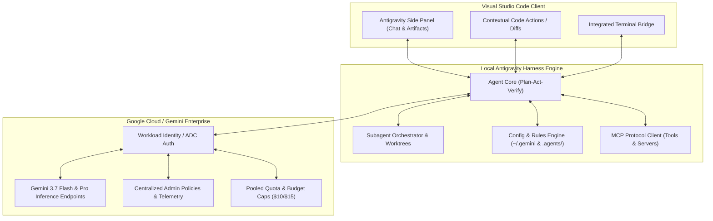

# 🔌 Reporte Técnico: Investigación de la Extensión de Visual Studio Code y Ecosistema Antigravity

**Objetivo:** Proporcionar al equipo técnico de Unicomer (y a los líderes de arquitectura) la información detallada sobre la disponibilidad, mapa de ruta (roadmap), arquitectura interna, métodos de autenticación y configuración del plugin de **Visual Studio Code** para Antigravity.

---

## 📌 1. Estado y Disponibilidad en el Roadmap

Conforme a la documentación oficial y el roadmap corporativo de Google Antigravity:

| Característica / Entorno | Estado de Lanzamiento | Detalle de Disponibilidad |
| :--- | :--- | :--- |
| **VS Code Extension** | **General Availability (GA)** | **Disponible (Roadmap Agosto)**. Soporte completo en VS Code (Linux, macOS, Windows). |
| **JetBrains Suite (IntelliJ, PyCharm, WebStorm)** | **General Availability (GA)** | **Disponible (Roadmap Agosto)**. Plugin nativo. |
| **Zed & Visual Studio (Full)** | **General Availability (GA)** | **Disponible (Roadmap Agosto)**. |
| **Eclipse IDE** | **General Availability (GA)** | **Septiembre - Diciembre**. |
| **Antigravity CLI** | **General Availability (GA)** | **Disponible**. Compatible con Bash, Zsh, Fish y PowerShell. |
| **Antigravity 2.0 (GUI Web/Desktop)** | **General Availability (GA)** | **Disponible**. Orquestador completo con soporte de voz y artefactos. |
| **Antigravity Web Remote Control** | **Private Preview (Ago) ➔ GA (Sep-Dic)** | Control remoto de entornos de desarrollo en la nube. |

---

## 🏛️ 2. Arquitectura de Integración en VS Code

La extensión de VS Code de Antigravity no es un simple cliente de chat HTTP; utiliza el **Unified Antigravity Harness**:



### Ventajas de esta Arquitectura para Unicomer:
1. **Un solo cerebro, múltiples ventanas:** Las conversaciones, tareas y planes creados en el CLI o en Antigravity 2.0 pueden continuarse dentro de VS Code sin perder contexto.
2. **Edición atómica y Diffs:** El motor no sobreescribe archivos ciegamente; genera diffs visuales interactivos en VS Code para que el desarrollador pueda aceptar o rechazar bloques específicos.
3. **Ejecución Segura en Sandbox:** Los comandos de terminal disparados por el agente corren con las políticas corporativas definidas por los administradores de Unicomer (modo revisión o ejecución en sandbox aislado).

---

## 🔑 3. Mecanismos de Autenticación Empresarial

Para eliminar la necesidad de que los desarrolladores manejen API keys estáticas o inseguras, la extensión y el CLI soportan:

### A. Application Default Credentials (ADC)
Permite a los desarrolladores autenticarse con su cuenta corporativa de Google Cloud / Google Workspace:
```bash
# Autenticación estándar para desarrolladores
gcloud auth application-default login
```

### B. Workload Identity Federation (WIF)
Para entornos de integración continua (CI/CD) o estaciones virtuales donde se utiliza el proveedor de identidad corporativo de Unicomer (ej. Okta, Azure AD / Entra ID, PingFederate).
- Sin llaves de cuenta de servicio (*Service Account Keys*) de larga duración.
- Asignación automática de cuotas agrupadas según el proyecto asignado en Gemini Enterprise.

---

## ⚙️ 4. Configuración del Entorno de Desarrollo (Zero-Friction Setup)

Para que el equipo de Unicomer comience a desarrollar en menos de 5 minutos, la configuración se estructura en dos niveles:

### Nivel 1: Configuración Global del Desarrollador (`~/.gemini/`)
- `~/.gemini/settings.json`: Configuración general del modelo por defecto (Gemini 3.7 Flash), modo de telemetría y credenciales.
- `~/.gemini/AGENTS.md`: Reglas globales compartidas de estilo y buenas prácticas.
- `~/.gemini/skills/`: Directorio donde el desarrollador puede instalar habilidades transversales.

### Nivel 2: Configuración a Nivel de Repositorio (`.agents/` y `GEMINI.md`)
Dentro de cualquier repositorio de Unicomer (ej. un microservicio bancario, portal retail o app móvil):
- `.agents/skills/<nombre-skill>/SKILL.md`: Habilidades específicas del repositorio (ej. validación de contratos API, reglas de negocio de crédito).
- `GEMINI.md` o `.agents/AGENTS.md`: Instrucciones y convenciones del proyecto (linters requeridos, directrices de arquitectura, librerías prohibidas).

---

## 🛡️ 5. Gobernanza y Políticas de Administrador para Unicomer

Desde la consola central de **Google Cloud / Gemini Enterprise Admin**, los líderes de TI y el equipo de Seguridad de Unicomer pueden aplicar políticas obligatorias que la extensión de VS Code y Antigravity respetarán automáticamente:

| Política de Admin | Configuración Recomendada para Unicomer | Impacto |
| :--- | :--- | :--- |
| **Strict Mode** | `Enabled` | Fuerza al agente a verificar todas las acciones contra los estándares de seguridad antes de aplicar cambios. |
| **Outside of file access policy** | `Always ask` | El agente no puede leer archivos fuera del directorio de trabajo sin permiso explícito del desarrollador. |
| **Terminal auto-execution** | `Require review` (o `Permitted in sandbox`) | Todo comando de consola (`pytest`, `npm build`, `docker`) requiere confirmación del usuario o se aísla en sandbox. |
| **MCP Servers** | `Allowlisted only` | Solo se permite la conexión a servidores MCP homologados por Unicomer (ej. base de datos de pruebas, catálogo Looker). |
| **Prompt & Response Logging** | `Enabled` | Trazabilidad completa para auditoría de cumplimiento financiero (sin usar datos para entrenar modelos públicos). |
| **Authorized Models** | `Gemini 3.7 Flash`, `Gemini Pro` | Restringe el uso a modelos aprobados y optimizados para la organización. |

---

## 🚀 6. Estrategia de Despliegue para el Grupo Piloto

1. **Paso 1: Habilitación en Consola GCP:** Asignar licencias de Gemini Enterprise (Standard o Plus) a las cuentas de correo de los desarrolladores piloto.
2. **Paso 2: Distribución de la Extensión:**
   - Instalar desde el Marketplace de VS Code (`Google Antigravity Extension`), o
   - Distribuir el archivo `.vsix` empaquetado para despliegues internos gestionados.
3. **Paso 3: Clonación del Repositorio de Laboratorio:** Los desarrolladores clonan el repositorio con el archivo de reglas `GEMINI.md` pre-configurado y comienzan a ejecutar el flujo `Plan → Act → Verify`.
