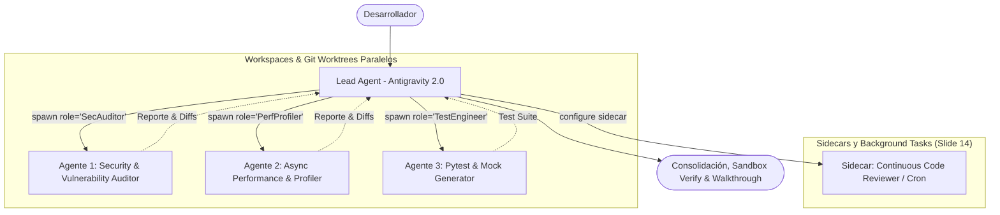

# 🧪 Laboratorio 3: Creación y Orquestación de Agentes Locales y Subagentes en Antigravity 2.0

**Audiencia:** Desarrolladores Backend, Tech Leads y DevOps de Unicomer  
**Tiempo estimado:** 30 - 35 minutos  
**Superficie de Trabajo:** **Antigravity 2.0 (GUI / Web)**  
**Objetivo:** Aprender a definir, instanciar y orquestar **Agentes Locales Especializados y Subagentes en Paralelo** (con selección dinámica de modelos, ramas aisladas y sidecars de larga duración) exactamente como lo describe la arquitectura de Antigravity (Slides 13 y 14).

---

## 🎯 Conceptos Clave del Laboratorio (Antigravity Agent Harness)

En Antigravity 2.0, los agentes no son solo hilos de chat; son entidades autónomas que puedes crear y coordinar:



---

## 👣 Paso a Paso del Laboratorio

### Ejercicio 1: Crear un Agente Local Especializado con Prompt Dinámico

En Antigravity 2.0, puedes definir un agente local con herramientas y rol a la medida:

#### 📋 Prompt para Antigravity 2.0:
```text
Define y crea un nuevo agente local especializado llamado 'SecurityAuditorAgent':
- Rol: Auditor de Seguridad y Cumplimiento Financiero.
- System Prompt: "Eres un auditor de seguridad senior. Tu tarea es analizar el código fuente en busca de exposición de PII (DUI, NIT, teléfonos), vulnerabilidades OWASP (inyecciones, validación de inputs) y proponer parches inmediatos con diffs atómicos."
- Permisos: Herramientas de lectura de código, edición de archivos y ejecución de pruebas.
```

#### 👁️ Lo que verás en Antigravity 2.0:
- Antigravity registra el agente local con su identificador único de conversación y su rol dedicado.

---

### Ejercicio 2: Orquestación de Subagentes en Paralelo (*Parallel Worktrees*)

Ahora pediremos al Lead Agent que asamble un equipo de agentes para refactorizar y verificar el microservicio en paralelo:

#### 📋 Prompt para Antigravity 2.0:
```text
Lanza 3 subagentes en paralelo para modernizar 'unicomer-sample-app':
1. Subagente 'Architect' (Gemini 3.7 Flash): Refactoriza 'main.py' hacia Clean Architecture (routers/, services/, schemas/).
2. Subagente 'SecurityAuditor' (Gemini 3.7 Flash): Escanea todo el código, elimina logs con datos sensibles y enmascara identificadores.
3. Subagente 'TestEngineer' (Gemini Flash-Lite): Genera una suite de pruebas completa en 'test_main.py' con pytest fixtures.

Trabajen de forma concurrente y consolidar los cambios en el proyecto principal cuando finalicen.
```

#### 👁️ Lo que verás en Antigravity 2.0:
- **Panel de Subagentes Activos:** Aparecen 3 tarjetas de trabajo en tiempo real con sus respectivos roles y modelos asignados.
- **Git Worktrees Aislados:** Cada subagente trabaja en su propio contexto sin colisionar con los archivos del otro.
- **Consolidación Automática:** El Lead Agent integra los tres reportes y aplica los diffs finales de forma limpia.

---

### Ejercicio 3: Comunicación Agente-a-Agente (Agent-to-Agent Messaging)

Observa cómo el Lead Agent envía instrucciones de ajuste a un subagente específico:

#### 📋 Prompt para Antigravity 2.0:
```text
Pídele al subagente 'TestEngineer' que agregue 3 pruebas parametrizadas adicionales para validar solicitudes de crédito con montos de $0 USD, términos de 72 meses (inválidos) y clientes con DTI del 80%, y que ejecute pytest.
```

#### 👁️ Lo que verás en Antigravity 2.0:
- El Lead Agent utiliza el protocolo de mensajería interna (`send_message`) para instruir al subagente en segundo plano sin interrumpir la sesión principal.

---

### Ejercicio 4: Crear un Agente Sidecar de Larga Duración (Slide 14)

Los **Sidecars** son utilidades que corren en background o se disparan periódicamente (por Cron o webhooks) para monitorear el repositorio:

#### 📋 Prompt para Antigravity 2.0:
```text
Configura un sidecar local llamado 'pr-lint-watcher' que revise automáticamente la calidad del código, verifique que ningún commit viole la habilidad 'fastapi-clean-architecture' y notifique cuando se detecte una regresión.
```

#### 👁️ Lo que verás en Antigravity 2.0:
- Antigravity crea la configuración del sidecar (`sidecar.json`) con su política de reinicio y escucha en background.

---

### Ejercicio 5: Verificación en Sandbox y Reporte de Entrega

#### 📋 Prompt para Antigravity 2.0:
```text
Ejecuta la suite de pruebas consolidada con pytest en el sandbox y genera un artefacto 'walkthrough.md' que documente:
1. Las modificaciones arquitectónicas realizadas por los subagentes.
2. Los parches de seguridad de PII aplicados.
3. El resultado de ejecución de los tests unitarios.
```

---

## ✅ Criterios de Éxito del Laboratorio
- [ ] Creaste un agente local especializado con prompt y herramientas dedicadas.
- [ ] Desplegaste 3 subagentes trabajando concurrentemente en tareas de arquitectura, seguridad y QA.
- [ ] Experimentaste la comunicación reactiva entre agentes (*Agent-to-Agent*).
- [ ] Configuraste un agente sidecar para monitoreo continuo en segundo plano.
- [ ] Verificaste la consolidación total en el sandbox con 100% de tests pasando.
